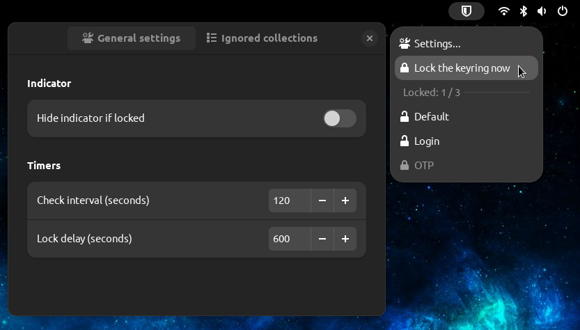

Keyring Autolock
================

This is a GNOME Shell extension to automatically lock the Keyring.

 - The status icon indicates if it's completely unlocked, partially locked, or fully
   locked. Optionally, the icon can be hidden wen fully locked.

 - It can completely lock the Keyring with a single click.
 
 - All collections are shown, with their locked state; clicking on a collection locks it.
 
 - Check interval and lock delay can be configured.
 
 - Collections can be marked to be ignored by the extension.

Installing from GNOME Extensions website
----------------------------------------

The extension can be installed from the [GNOME Shell Extensions
website](https://extensions.gnome.org/extension/6846/keyring-autolock/).

Installing from sources
-----------------------

Prerequisites:

  - [make](https://www.gnu.org/software/make/)

  - [jq](https://stedolan.github.io/jq/)

Run:

    make install

